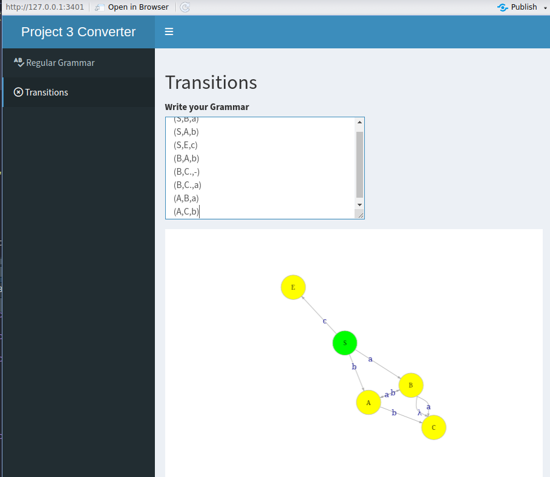
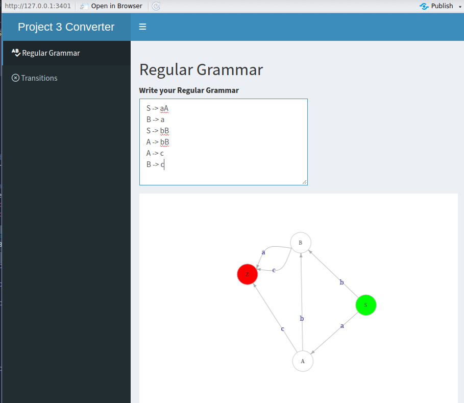

# Implementation of Computational Methods | 4th Semester

> Professor: Enrique Garcia Ceja

This repository contains various projects developed during the course of Computational Methods in the 4th semester. The projects cover a range of topics, including the implementation of an automaton, a converter from regular grammar to finite automaton, and a basic tokenizer.

## Projects Overview

1. Web Dashboard for Regular Grammar:
   - The code is written in R and utilizes the Shiny framework to create a web-based dashboard. The dashboard consists of two tabs: "Regular Grammar" and "Transitions". 
   - In the "Regular Grammar" tab, users can input a regular grammar in a text area. The input text is then processed to extract edges and nodes from the grammar. The extracted information is used to create a directed graph using the `igraph` library. The graph is plotted with arrows, labels, and colors corresponding to the edges and nodes.
   -  
   - The "Transitions" tab allows users to input a specific format of transitions in a text area. Similar to the "Regular Grammar" tab, the input text is processed to extract edges and nodes. These edges and nodes are used to create a directed graph, and the graph is plotted with appropriate labels and colors.
   - Both tabs provide an interactive visualization of the graphs based on the user input. The application makes use of various R libraries such as `shiny`, `igraph`, and `shinydashboard` to create the interactive dashboard.
   -  
2. Automaton Implementation:
   - This project focuses on implementing an automaton using Python. It separates the input (a string) into tokens and analyses to which category does it belong to.

3. Basic Tokenizer:
   - The project is a Python script that performs tokenization on an input file and generates an HTML file with syntax highlighting for different categories of tokens. It uses regular expressions to identify tokens and applies HTML styling to format them appropriately. The resulting HTML file displays the tokens with different colors based on their categories.

## License

This project is licensed under the [MIT License](LICENSE). Feel free to use and modify the code as per your needs.